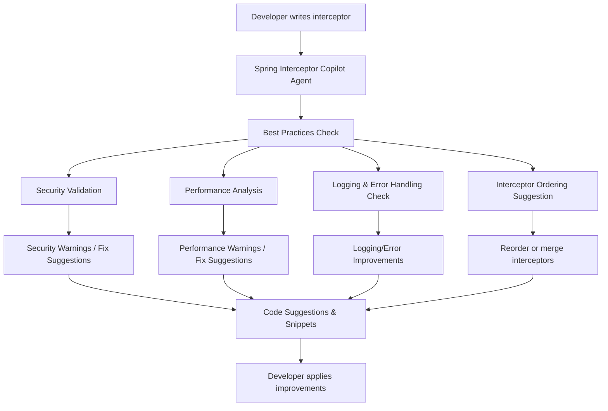

# Spring Interceptor Best Practices Copilot Agent

**Version:** 1.0.0
**Author:** Maheswar Buddolla
**Date:** 2026-03-09

---

## Overview / Purpose

This Copilot Agent helps Java developers implement **Spring MVC interceptors** efficiently and correctly by providing **best practice guidance**, **code suggestions**, and **ready-to-use templates**.

Target Users: Java developers using Spring MVC who want to ensure security, performance, and maintainability in interceptors.

---

## JSON Configuration

```json
{
  "agentName": "Spring Interceptor Best Practices",
  "description": "Provides guidance, code suggestions, and best practices for implementing Spring MVC interceptors.",
  "version": "1.0.0",
  "language": "java",
  "capabilities": [
    {
      "name": "Best Practices Analysis",
      "description": "Analyzes interceptor code for proper preHandle, postHandle, and afterCompletion usage.",
      "triggers": ["fileSave", "codeEdit"],
      "actions": [
        {
          "type": "lint",
          "rules": [
            {
              "id": "preHandle_security_check",
              "description": "Ensure preHandle validates requests and checks authentication.",
              "severity": "warning"
            },
            {
              "id": "postHandle_usage",
              "description": "Use postHandle for response modification, not heavy logic.",
              "severity": "info"
            },
            {
              "id": "afterCompletion_cleanup",
              "description": "Use afterCompletion for resource cleanup and logging.",
              "severity": "info"
            }
          ]
        },
        {
          "type": "performanceCheck",
          "rules": [
            {
              "id": "heavy_computation",
              "description": "Avoid heavy computations inside interceptors; consider async processing.",
              "severity": "warning"
            }
          ]
        },
        {
          "type": "orderingCheck",
          "rules": [
            {
              "id": "interceptor_order",
              "description": "Ensure interceptors are registered in the correct order in InterceptorRegistry.",
              "severity": "info"
            }
          ]
        },
        {
          "type": "loggingCheck",
          "rules": [
            {
              "id": "centralized_logging",
              "description": "Ensure exceptions and key events are logged centrally.",
              "severity": "info"
            }
          ]
        }
      ]
    },
    {
      "name": "Code Snippet Generator",
      "description": "Generates ready-to-use interceptor skeletons and examples for common tasks.",
      "triggers": ["commandPalette", "contextMenu"],
      "actions": [
        {
          "type": "snippet",
          "examples": [
            {
              "name": "AuthenticationInterceptor",
              "code": "public class AuthenticationInterceptor implements HandlerInterceptor {\n\n    @Override\n    public boolean preHandle(HttpServletRequest request, HttpServletResponse response, Object handler) throws Exception {\n        // Validate authentication\n        return true;\n    }\n\n    @Override\n    public void postHandle(HttpServletRequest request, HttpServletResponse response, Object handler, ModelAndView modelAndView) throws Exception {\n        // Optional: modify response\n    }\n\n    @Override\n    public void afterCompletion(HttpServletRequest request, HttpServletResponse response, Object handler, Exception ex) throws Exception {\n        // Cleanup resources\n    }\n}"
            },
            {
              "name": "LoggingInterceptor",
              "code": "public class LoggingInterceptor implements HandlerInterceptor {\n\n    @Override\n    public boolean preHandle(HttpServletRequest request, HttpServletResponse response, Object handler) throws Exception {\n        System.out.println(\"Request URL: \" + request.getRequestURL());\n        return true;\n    }\n\n    @Override\n    public void afterCompletion(HttpServletRequest request, HttpServletResponse response, Object handler, Exception ex) throws Exception {\n        System.out.println(\"Request completed\");\n    }\n}"
            }
          ]
        }
      ]
    }
  ],
  "integration": {
    "ide": ["VS Code", "IntelliJ"],
    "triggers": ["onSave", "onCodeEdit", "commandPalette"]
  }
}
```

---

## Capabilities & Actions Explained

### 1. Best Practices Analysis

* **Lint rules:** Validates correct use of `preHandle`, `postHandle`, and `afterCompletion`. Warns about security and performance issues.
* **Performance Check:** Detects heavy computation in interceptors.
* **Ordering Check:** Ensures correct order of interceptors.
* **Logging Check:** Ensures proper centralized logging and error handling.

### 2. Code Snippet Generator

* Generates ready-to-use interceptor templates.
* Examples include **AuthenticationInterceptor** and **LoggingInterceptor**.
* Triggered manually via **command palette** or **context menu**.

### 3. Integration

* Works in **VS Code** and **IntelliJ**.
* Triggers on **file save**, **code edit**, or manually via **command palette**.

---

## Workflow Diagram



---

## Example Interceptor Snippets

### AuthenticationInterceptor

```java
public class AuthenticationInterceptor implements HandlerInterceptor {

    @Override
    public boolean preHandle(HttpServletRequest request, HttpServletResponse response, Object handler) throws Exception {
        // Validate authentication
        return true;
    }

    @Override
    public void postHandle(HttpServletRequest request, HttpServletResponse response, Object handler, ModelAndView modelAndView) throws Exception {
        // Optional: modify response
    }

    @Override
    public void afterCompletion(HttpServletRequest request, HttpServletResponse response, Object handler, Exception ex) throws Exception {
        // Cleanup resources
    }
}
```

### LoggingInterceptor

```java
public class LoggingInterceptor implements HandlerInterceptor {

    @Override
    public boolean preHandle(HttpServletRequest request, HttpServletResponse response, Object handler) throws Exception {
        System.out.println("Request URL: " + request.getRequestURL());
        return true;
    }

    @Override
    public void afterCompletion(HttpServletRequest request, HttpServletResponse response, Object handler, Exception ex) throws Exception {
        System.out.println("Request completed");
    }
}
```

---

## Summary

* The agent ensures **security, performance, and maintainability** of Spring interceptors.
* Provides **automatic checks** and **ready-to-use templates**.
* Can be **extended** with new rules or snippets as needed.
* Ideal for both **junior and senior developers** to enforce best practices.
